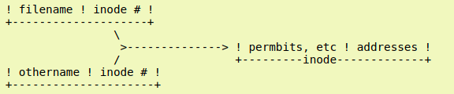

- [where does the browser save the cache](#where-does-the-browser-save-the-cache)
- [what are inodes](#what-are-inodes)
- [hard link vs softlink](#hard-link-vs-softlink)
- [OSI model](#osi-model)
- [deployments startegies](#deployments-startegies)
- [CDN](#cdn)
- [what is a container](#what-is-a-container)
- [docker image](#docker-image)
- [namespaces used by docker](#namespaces-used-by-docker)
- [docker Network driver summary](#docker-network-driver-summary)
- [what happens when you type in browser www.amazon.com](#what-happens-when-you-type-in-browser-wwwamazoncom)
- [techniques to scale a relational database](#techniques-to-scale-a-relational-database)
- [how nat works](#how-nat-works)
- [What is a service? How can I check the logs of a service? where are they located? How can I check the status of a service? How can I start a service?**](#what-is-a-service-how-can-i-check-the-logs-of-a-service-where-are-they-located-how-can-i-check-the-status-of-a-service-how-can-i-start-a-service)
- [Paging and swapping](#paging-and-swapping)
- [what do you do if a customer says their server is using too much RAM**](#what-do-you-do-if-a-customer-says-their-server-is-using-too-much-ram)
- [Suppose that i'm a client and i cannot connect to a remote server using ssh. How do you troubleshoot this problem ?**](#suppose-that-im-a-client-and-i-cannot-connect-to-a-remote-server-using-ssh-how-do-you-troubleshoot-this-problem-)
- [Slow system performance: reasons and troubleshooting tools/steps**](#slow-system-performance-reasons-and-troubleshooting-toolssteps)
- [latency vs throughput](#latency-vs-throughput)
- [How can we check if there is an open connection to a remote host?](#how-can-we-check-if-there-is-an-open-connection-to-a-remote-host)
- [how checj if a port is open/closed on a remote server](#how-checj-if-a-port-is-openclosed-on-a-remote-server)
- [3-way handshake](#3-way-handshake)
- [How does TCP terminate a session](#how-does-tcp-terminate-a-session)
- [symmetric and asymmetric encryption](#symmetric-and-asymmetric-encryption)
- [LVM](#lvm)

### where does the browser save the cache

in the os speceficly in the hidden cache directory located in the home directory

**[`^        back to top        ^`](#)**
### what are inodes

a data structure to store metadata about a file/directory

Whenever a user or a program refers to a file by name, the operating system uses that name to look up the corresponding inode, which then enables the system to obtain the information it needs about the file to perform further operations. That is, a file name in a Unix-like operating system is merely an entry in a table with inode numbers, rather than being associated directly with a file (in contrast to other operating systems such as the Microsoft Windows systems). The inode numbers and their corresponding inodes are held in inode tables, which are stored in strategic locations in a filesystem, including near its beginning.

more info : https://linuxgazette.net/105/pitcher.html
http://www.linfo.org/inode.html

**[`^        back to top        ^`](#)**
### hard link vs softlink
hard link : two files are hardlinked, when both filename can reference the same inode number and thus the same content.\
\
`ln basic.file hardlink.file`\
soft link : the data part of this file carries a path to another file
\
`ln -s basic.file softlink.file`

**[`^        back to top        ^`](#)**
### OSI model

**The OSI Model** is a stabdard that breaks down network communication into seven layers useful for identifying network issues.

an issue can be narrowed down to one specific layer so a lot of unnecessary work can be avoided

**Application layer** : helps software applications like web browsers and email clients to initiate communications and it's the only layer that interacts with data from the user. (HTTP, SMTP)

**Presentation layer** : responsible for preparing data so it can be readable by the application layer, this where the **encryption** of data is done before sending it to the session layer in case of encapsulation and where the descryption happens in case of decapsulation, **translation** from one encodying method to an other , **compression** to speed up the transmission.

**Session layer** : responsible for opening and closing communication between the two devices long enough to transfer all data requested,  synchronizes data transfer with checkpoints (no need to start transferring again from scratch if a problem occurs )

**Transport layer** : responsable for breaking the data recieved from the session layer into chunks called **segments** before sending it to layer 3 (encapsulation), reassembling the segments into data that the session layer can consume(decapsulation), **flow controll** and **error control**.\
<ins>Flow control</ins> determines an optimal speed of transmission to ensure that a sender with a fast connection doesn’t overwhelm a receiver with a slow connection.\
<ins>Error control</ins> ensures that the data received is complete, and requesting a retransmission if it isn’t by using checksum.

**Network layer** : responsible for facilitating data transfer between two **different networks**, breaks up **segments** from the transport layer into **packets, routing**.

**Data link layer** : facilitates data transfer between two devices on the **SAME network** , breaks packets to **frames**, **flow controll** and **error contoll on the same network**.

**Physical layer** : includes the physical equipment involved in the data transfer, breaks **frames to bit stream (1s, 0s)**.

**[`^        back to top        ^`](#)**
### deployments startegies

**In-Place Deployments**
the deployment is done when the application on each instance in the deployment group is stopped, the latest application revision is installed, and the new version of the application is started and validated. (can be done all at once, or as a rouling update).

**Blue/Green Deployments**
technique for releasing applications by shift traffic between two identical environments running differing versions of the application.
Blue/green deployments enable you to launch a new version (green) of your application alongside the old version (blue).
**rollback strategy** : switch the router back to your blue environment.

**Canary Deployments**
you start by deploying the new version of your software to a subset of your infrastructure, to which no users are routed, When you are happy with the new version, you can start routing a few selected users to it.
As you gain more confidence in the new version, you can start releasing it to more servers in your infrastructure and routing more users to it.
**rollback strategy** is simply to reroute users back to the old version until you have fixed the problem.

more info : https://martinfowler.com/bliki/BlueGreenDeployment.html

**[`^        back to top        ^`](#)**
### CDN
a CDN is a network of servers linked together with the goal of delivering content as quickly, cheaply, reliably, and securely as possible. In order to improve speed and connectivity.

more info : https://www.cloudflare.com/learning/cdn/what-is-a-cdn/

**[`^        back to top        ^`](#)**
### what is a container

The Open Container Initiative (OCI) develops specifications for standards on Operating System process and application containers
The Docker engine is modular in design and based heavily on open-standards from the OCI.
The Docker daemon implements the Docker API which is currently a rich, versioned, HTTP API that has developed alongside the rest of the Docker project.
Container execution is handled by **containerd**. **containerd** was written by Docker, Inc. and contributed to the CNCF.

You can think of it as a container supervisor that handles container lifecycle operations.
It is small and lightweight and can be used by other projects and third-party tools.
For example, it’s becoming the most common container runtime in Kubernetes.
**containerd** needs to talk to an **OCI-compliant container runtime** to actually create containers.

By default, Docker uses **runc** as its default container runtime.
**runc** is the de facto implementation of the **OCI runtime-spec** and expects to start containers from OCI-compliant bundles.
**containerd** talks to **runc** and ensures Docker ../assets/images/article_post are presented to **runc** as OCI-compliant bundles.
in fact it forks a new instance of **runc** for every container it creates. However, once each container is created, the parent **runc** process exits.
This means we can run hundreds of containers without having to run hundreds of runc instances.

Once a container’s parent runc process exits, the associated **containerd-shim** process becomes the container’s parent
**runc** can be used as a standalone CLI tool to create containers. It’s based on code from **libcontainer**, and can also be used by other projects and third-party tools.
There is still a lot of functionality implemented in the Docker daemon.
More of this may be broken out over time. Functionality currently still inside of the Docker daemon includes, but is not limited to; the Docker API, image management, authentication, security features and core networking.
On a Linux system, the components we’ve discussed are implemented as separate binaries as follows:
dockerd (the Docker daemon)
docker-containerd (containerd)
docker-containerd-shim (shim)
docker-runc (runc)

how it works

**[`^        back to top        ^`](#)**
### docker image
A Docker image is a unit of packaging that contains everything required for an application to run. This includes; application code, application dependencies, and OS constructs.

The manifest list (image index) is a list of architectures supported by a particular image tag. Each supported architecture then has its own manifest detailing the layers that make it up.

**[`^        back to top        ^`](#)**
### namespaces used by docker
Through the use of namespaces and cgroups. Linux kernel has several types of namespaces:

**Process ID namespaces**: these namespaces include independent set of process IDs\
**Mount namespaces:** Isolation and control of mountpoints\
**Network namespaces:** Isolates system networking resources such as routing table, interfaces, ARP table, etc.\
**UTS namespaces:** Isolate host and domains\
**IPC namespaces:** Isolates interprocess communications\
**User namespaces:** Isolate user and group IDs\
**Time namespaces:** Isolates time machine\

**[`^        back to top        ^`](#)**
### docker Network driver summary
**User-defined bridge** networks are best when you need multiple containers to communicate on the same Docker host.(managed by docker network cmd)

**Host networks are best** when the network stack should not be isolated from the Docker host, but you want other aspects of the container to be isolated.

**Overlay networks** are best when you need containers running on different Docker hosts to communicate, or when multiple applications work together using swarm services.

**Macvlan networks** are best when you are migrating from a VM setup or need your containers to look like physical hosts on your network, each with a unique MAC address.

**Third-party network** plugins allow you to integrate Docker with specialized network stacks.

**[`^        back to top        ^`](#)**
### what happens when you type in browser www.amazon.com
The browser tries to figure out the IP address for the entered domain. The DNS lookup proceeds as follows:

the browser checks its cache, If the browser cache does not contains the desired record, the browser makes a system call to the os which in its turn check its cache, if not found,the request continue to the router, which typically has its own DNS cache,if ip is not found, the request continue to internet service provider (ISP), which in its turn checks its cache, if the IP adresse is not found at any of those cache layers, the dns recursive resolver asks the root name server, the root name server reply with the IP of the top level domain which in its turn reply with the IP of the domain's name server and then the respanse is giving back to the browser
when the IP address of the domain name is found the browser needs to establish a TCP connection with the server
so if https is used, a tls handshake will take place.

* The client computer sends a ClientHello message to the server with its TLS version, list of cipher algorithms and compression methods available.
* The server replies with a ServerHello message to the client with the TLS version, selected cipher, selected compression methods and the server's public certificate signed by a CA (Certificate Authority). The certificate contains a public key that will be used by the client to encrypt the rest of the handshake until a symmetric key can be agreed upon.
* The client verifies the server certificate against its list of trusted CAs.and if it is valid, the client generates a string of pseudo-random bytes and encrypts this with the server's public key. These random bytes can be used to determine the symmetric key.
* The server decrypts the random bytes using its private key and uses these bytes to generate its own copy of the symmetric master key.
* The client sends a Finished message to the server, encrypting a hash of the transmission up to this point with the symmetric key.
* The server generates its own hash, and then decrypts the client-sent hash to verify that it matches. If it does, it sends its own Finished message to the client, also encrypted with the symmetric key.
From now on the TLS session transmits the application (HTTP) data encrypted with the agreed symmetric key. 

**[`^        back to top        ^`](#)**
###  techniques to scale a relational database
* Master-slave replication
  
  The master serves reads and writes, replicating writes to one or more slaves, which serve only reads. Slaves can also replicate to additional slaves in a tree-like fashion. If the master goes offline, the system can continue to operate in read-only mode until a slave is promoted to a master or a new master is provisioned.
  

* Master-master replication
  
  Both masters serve reads and writes and coordinate with each other on writes. If either master goes down, the system can continue to operate with both reads and writes.
  

* Federation or functional partitioning
   splits up databases by function. For example, instead of a single, monolithic database, you could have three databases: forums, users, and products, resulting in less read and write traffic to each database and therefore less replication lag. Smaller databases result in more data that can fit in memory, which in turn results in more cache hits due to improved cache locality. With no single central master serializing writes you can write in parallel, increasing throughput.
   
  
* Sharding
   Sharding distributes data across different databases such that each database can only manage a subset of the data. Taking a users database as an example, as the number of users increases, more shards are added to the cluster.Similar to the advantages of federation, sharding results in less read and write traffic, less replication, and more cache hits.
   

* Denormalization
  Denormalization attempts to improve read performance at the expense of some write performance. Redundant copies of the data are written in multiple tables to avoid expensive joins.(like index)

### how nat works
**Nat** : It’s a way to map multiple local private addresses to a public one before transferring the information.

**[`^        back to top        ^`](#)**
### What is a service? How can I check the logs of a service? where are they located? How can I check the status of a service? How can I start a service?**

- a service is a software that runs in the background , started when the server runs, systemd is a service manager,
- you can check the service logs by `journalctl -u service-name.service (journalctl -u sshd.service)`
- they are located in `/var/log`
- `systemctl status service-name.service , systemctl start service-name.service`

**[`^        back to top        ^`](#)**
### Paging and swapping

To swap a process means to move that entire process out of main memory and to the swap area on hard disk, whereby **all pages of that process** are moved at the same time.

Paging was introduced as a solution to the inefficiency of swapping entire processes in and out of memory at once. With paging, when the kernel requires more main memory for an active process, **only the least recently used pages** of processes are moved to the swap space.

In Linux there is no swapping just paging, but people are still calling it swapping

**the working sets** of a process are the most recently pages used in memory of that process in a given time

https://www.redhat.com/sysadmin/troubleshooting-slow-servers

**[`^        back to top        ^`](#)**
### what do you do if a customer says their server is using too much RAM**

*I'll check if is really taking too much RAM or just they missunderstand the metrics, as in Linux the available memory to applications is not only the total memory minus the used memory, but instead the total memory - used one + buffred/cached, because the OS uses disk caching to improve the system respanse,*

*so if any application needs memory the disk cache can be given back immediately. 
but if the available memory which is the free + buffred/Cached one is close to 0, and the swap space is increasing, and maybe the oom killer is killing some process, then yes, we need to start looking at the root cause.*
more : https://www.linuxatemyram.com/

**[`^        back to top        ^`](#)**
### Suppose that i'm a client and i cannot connect to a remote server using ssh. How do you troubleshoot this problem ?**
the first thing i'll do is asking the client about the output of the ssh command that he gets, the issue might be related to dns, remote host identification has changed and so on, the output of the ssh command will help me narrow down the issue, if it seems related to the DNS, I'll ask him to try using the IP adress directly instead of the hostname of the server.

**"Connection timed out"**
the server didn't respond
The security group or network ACL doesn't allow access.
There is a firewall on the instance's operating system.
There is a firewall between the client and the server.
The host doesn't exist. (maybe a dns issue)

**"Connection refused":**** 
this comes from the server
The host reached the instance but there was no service listening on the SSH port (ss -tl to check for listening port)
A firewall blocked and was set to reject the package instead of dropping it (iptables -F to delete all rules in the firewall on ubuntu).

**"Permission denied" or "Authentication failed**
You're trying to connect using the wrong user name for your AMI.
The file permissions within the operating system are incorrect on the instance.
The incorrect SSH public key (.pub) file is in the authorized_keys file.

more : https://aws.amazon.com/premiumsupport/knowledge-center/ec2-linux-ssh-troubleshooting/

**[`^        back to top        ^`](#)**
### Slow system performance: reasons and troubleshooting tools/steps**

**uptime t**o have an idea about the load average

**dmesg | tail** to see kernel logs maybe the oom killer started to kill some process or tcp is dropping requests

**vmstat 1** to see key metrics, cpu memory disk i/o swap and so on, maybe the cpu is saturated r > number of cpus

**mpstat -P ALL 1** to check CPU time breakdowns per CPU, maybe there is imabalance, or the application is single threaded

**pidstat 1 to** see how much each process is taking

**iostat -xz 1** to check the disk I/O, usualy I look at the **await** colomn to see how much time on average a request tooks and spent waiting in the queue, and I'll check also the average queue lenght **aqu-sz > 1 => saturation**

**free -m to see if the system has enough available memory**

**sar -n DEV 1**

**sar -n TCP,ETCP 1**

**top**

you can use **sar -1** to see yestrday's system metrics

**sar (system activity report)**

more : https://netflixtechblog.com/linux-performance-analysis-in-60-000-milliseconds-accc10403c55 https://netflixtechblog.com/linux-performance-analysis-in-60-000-milliseconds-accc10403c55

**[`^        back to top        ^`](#)**
### latency vs throughput
**network throughput** refers to how much data can be transferred from source to destination within a given timeframe

**Latency** is the amount of time it takes for a packet to make it from source to destination

**[`^        back to top        ^`](#)**
### How can we check if there is an open connection to a remote host?
using ss -t and cheking the established connection in the state column

**[`^        back to top        ^`](#)**
### how checj if a port is open/closed on a remote server
using nmap serverIP

**[`^        back to top        ^`](#)**
### 3-way handshake 
First, the source send an SYN “initial request” packet to the target server in order to start the dialogue. Then the target server then sends a SYN-ACK packet to agree to the process. Lastly, the source sends an ACK packet to the target to confirm the process, after which the message contents can be sent

**[`^        back to top        ^`](#)**
### How does TCP terminate a session

**[`^        back to top        ^`](#)**
### symmetric and asymmetric encryption

Symmetric encryption uses a single key (secret key) that needs to be shared among the recipients to be able to encrypt and decrypt messages (AES : Advanced Encryption standards 256), while asymmetric encryption uses a pair of public key and a private key to encrypt and decrypt messages (RSA)
asymetric encryption is relatively slow compared to symmetric encryption, but more secure as the private key is not shared

**[`^        back to top        ^`](#)**
### LVM
LVM provides an alternative that you can use when you’re partitioning the hard disk drives in your Linux system.
Basically, what it does is create an alternative to the traditional process of creating disk partitions and mounting them in the Linux file system instead of defining and creating partitions.\
Instead what you do is define **volume groups** from all the various storage devices in your system.
Then from the volume group we allocate space to specific **Logical Volumes** which are managed by the **Logical Volume Manager (LVM)**.
Then instead of mounting a partition in the file system and what you do is instead mount Logical Volumes at the various mount points in your file system.

more info : https://edumotivation.com/what-is-lvm-logical-volume-manager/

**[`^        back to top        ^`](#)**